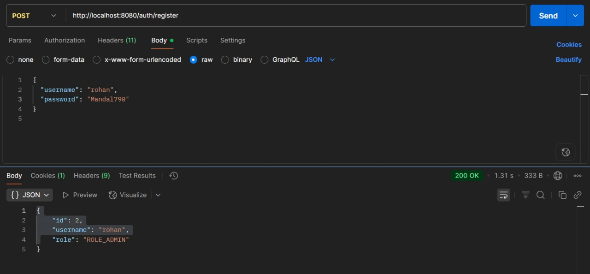
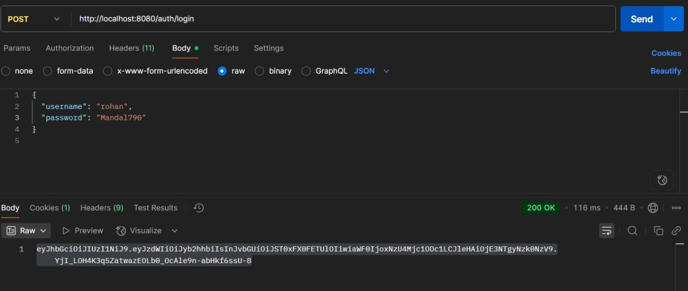
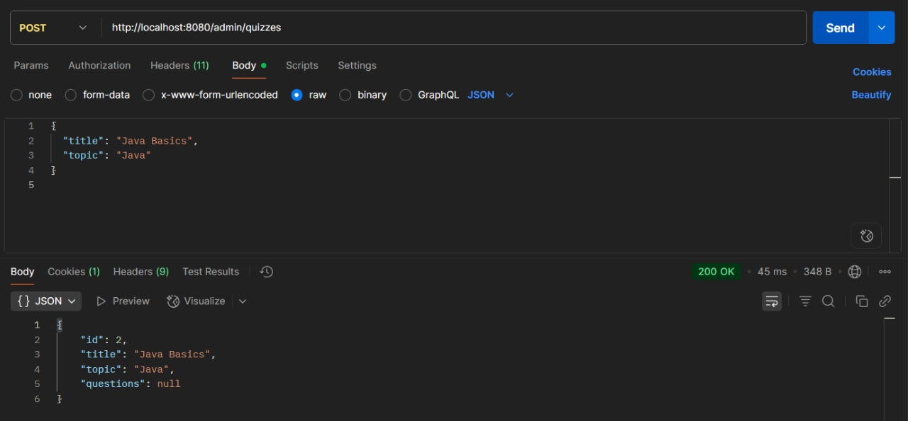
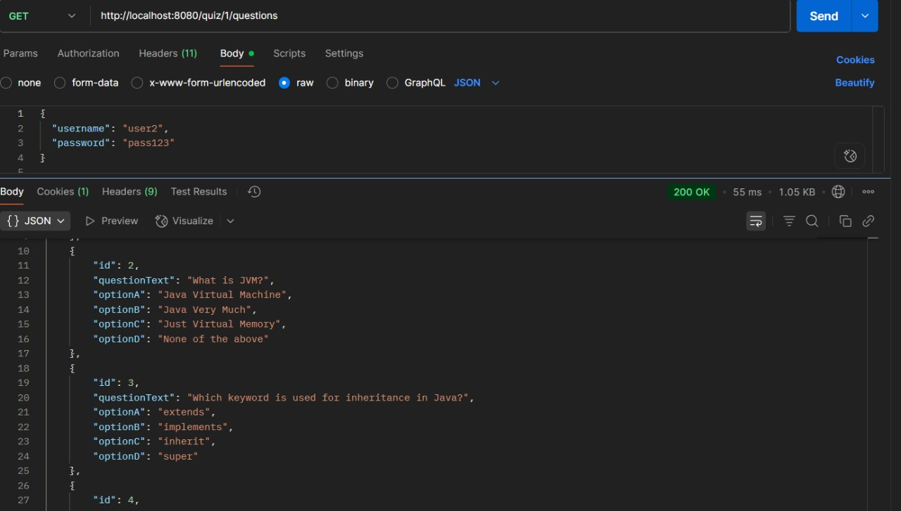
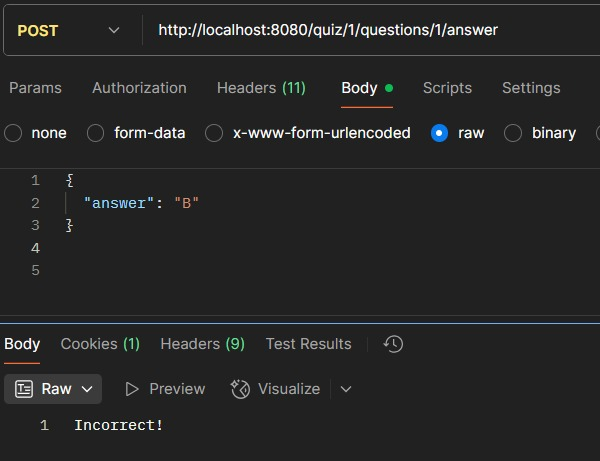
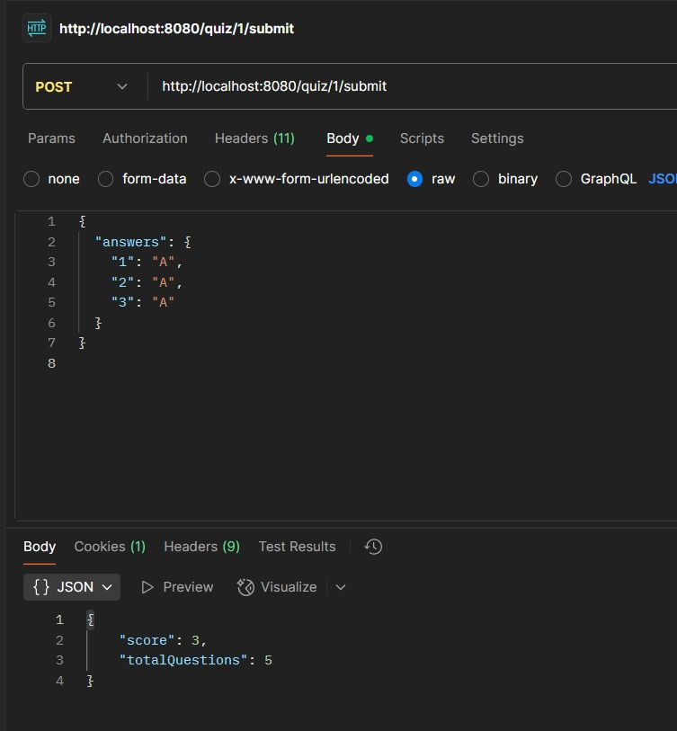
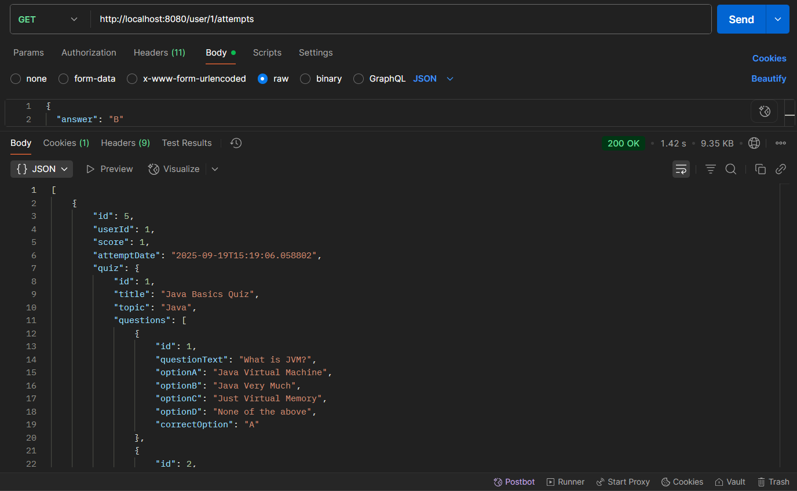

# 📝 Online Quiz Application (Backend Only)

### 📌 Internship Project – InnoByte Services  
Internship ID: **IS/A1/G5796**

---

## 📖 Project Description
This is a **Java Spring Boot Backend Application** for an **Online Quiz System**.  
It allows **admins** to create and manage quizzes and **users** to take them, get feedback, track progress, and view scores.  
All core features from the official requirements have been implemented ✅.

---

## 🚀 Tech Stack
- **Java 17**
- **Spring Boot 3**
- **Spring Data JPA (Hibernate)**
- **Spring Security (JWT Auth, BCrypt password hashing)**
- **MySQL Database**
- **Postman for API Testing**

---

## ✅ Features Implemented (as per requirements)

### 1. **User Authentication**
- Register new users  
- Login with credentials  
- Secure password storage (BCrypt)  
- Role-based access control (Admin vs User)  

📸 *Screenshots:*  
<p align="center">
  
  
</p>

---

### 2. **Quiz Management (Admin Only)**
- Create quizzes with **title + topic**  
- Add multiple-choice questions with **options + correct answer**  
- Edit quiz details  
- Delete quizzes  

📸 *Screenshots:*  
<p align="center">
  
  
</p>

---

### 3. **Quiz Taking (User)**
- Users can **fetch all questions** of a quiz  
- Submit **answers one by one** → get **Immediate feedback (Correct/Incorrect)**  
- Submit **entire quiz** at once → get final score  

📸 *Screenshots:*  
<p align="center">
  
  
  
</p>

---

### 4. **Scoring & Progress Tracking**
- Automatic scoring after submission  
- Saves each attempt with score + date  
- Users can **view their past attempts & progress**  

📸 *Screenshot:*  
<p align="center">
  
</p>

---

### 5. **Security**
- JWT-based authentication  
- **Admin Role** → Can manage quizzes (`/admin/**`)  
- **User Role** → Can take quizzes (`/quiz/**`, `/user/**`)  
- Enforced via **Spring Security**  

---

## ⚙️ Setup Instructions

### 1. Clone Repository
```bash
git clone https://github.com/rohanmandal341/quizapp-backend.git
cd quizapp-backend
````

### 2. Configure Database

Create a MySQL database:

```sql
CREATE DATABASE quizdb;
```

Update `src/main/resources/application.properties`:

```properties
spring.datasource.url=jdbc:mysql://localhost:3306/quizdb
spring.datasource.username=root
spring.datasource.password=yourpassword
spring.jpa.hibernate.ddl-auto=update
```

### 3. Build & Run

```bash
mvn spring-boot:run
```

App runs at: `http://localhost:8080`

---

## 📌 API Endpoints

### 🔑 Authentication

* `POST /auth/register` → Register new user (default role USER)
* `POST /auth/login` → Login and receive JWT token

### 👨‍💼 Admin (requires ROLE\_ADMIN)

* `POST /admin/quizzes` → Create quiz
* `PUT /admin/quizzes/{id}` → Update quiz
* `DELETE /admin/quizzes/{id}` → Delete quiz
* `POST /admin/quizzes/{id}/questions` → Add question

### 👩‍💻 User (requires ROLE\_USER)

* `GET /quiz/{id}/questions` → Get all questions (without answers)
* `POST /quiz/{id}/questions/{qid}/answer` → Submit single answer → feedback **Correct/Incorrect**
* `POST /quiz/{id}/submit` → Submit entire quiz → get score
* `GET /user/{id}/attempts` → Get past attempts

---

## 📦 Database Schema

* **users** (id, username, password\_hash, role)
* **quizzes** (id, title, topic)
* **questions** (id, quiz\_id, questionText, options A-D, correctOption)
* **quiz\_attempts** (id, user\_id, quiz\_id, score, attempt\_date)

---

## 🎯 Conclusion

All mandatory requirements from the project specification have been implemented:

* ✔️ Authentication (Register/Login with secure passwords)
* ✔️ Admin Quiz Management (CRUD + questions)
* ✔️ User Quiz Taking (questions, per-question feedback, scoring)
* ✔️ Progress Tracking (attempts & scores history)
* ✔️ Role-based Security (JWT)
* ✔️ Database persistence
